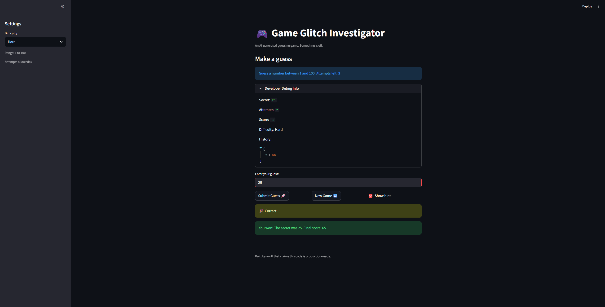

# 🎮 Game Glitch Investigator: The Impossible Guesser

## 🚨 The Situation

You asked an AI to build a simple "Number Guessing Game" using Streamlit.
It wrote the code, ran away, and now the game is unplayable. 

- You can't win.
- The hints lie to you.
- The secret number seems to have commitment issues.

## 🛠️ Setup

1. Install dependencies: `pip install -r requirements.txt`
2. Run the broken app: `python -m streamlit run app.py`

## 🕵️‍♂️ Your Mission

1. **Play the game.** Open the "Developer Debug Info" tab in the app to see the secret number. Try to win.
2. **Find the State Bug.** Why does the secret number change every time you click "Submit"? Ask ChatGPT: *"How do I keep a variable from resetting in Streamlit when I click a button?"*
3. **Fix the Logic.** The hints ("Higher/Lower") are wrong. Fix them.
4. **Refactor & Test.** - Move the logic into `logic_utils.py`.
   - Run `pytest` in your terminal.
   - Keep fixing until all tests pass!

## 📝 Document Your Experience

- [x] Describe the game's purpose.
  - A number guessing game built with Streamlit where the player must guess a secret number within a limited number of attempts.

- [x] Detail which bugs you found.
  - Hints were reversed (e.g., "Too High" said to go higher).
  - The game would not reset properly (new games didn’t clear state and submission stopped working).
  - The secret number would change between guesses because it wasn’t stored in session state.
  - Scoring was inconsistent and sometimes increased on wrong guesses.

- [x] Explain what fixes you applied.
  - Corrected hint messages so "Too High" tells the player to go lower and vice versa.
  - Used `st.session_state` to persist the secret number and game status across reruns, and reset state cleanly on a new game.
  - Refactored logic into `logic_utils.py` and added tests for `check_guess` and `parse_guess`.
  - Updated scoring logic so only correct guesses add points (scaled by attempt) and wrong guesses subtract a fixed penalty.

## 📸 Demo

- [x] []

## 🚀 Stretch Features

- [ ] [If you choose to complete Challenge 4, insert a screenshot of your Enhanced Game UI here]
